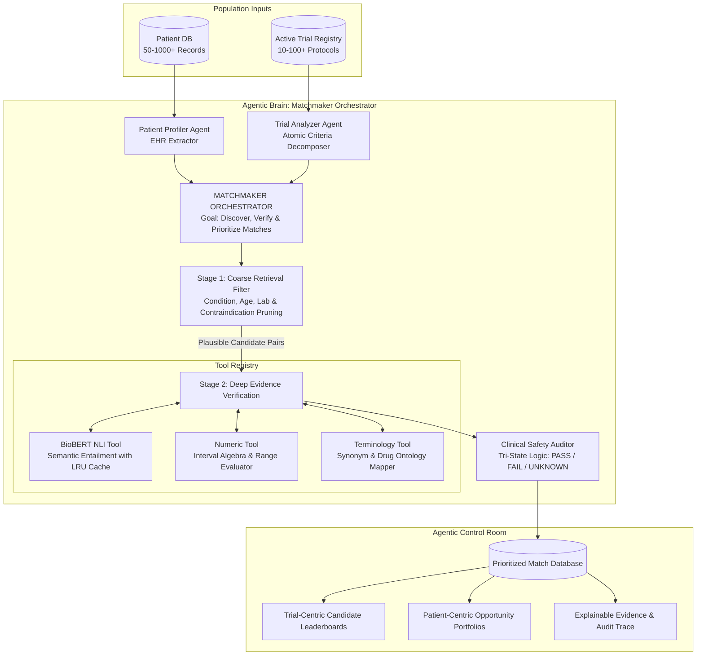

# TrialMatch 2.0: AI Architecture, Transfer Learning & Multi-Agent Cognitive Report

This document outlines the architectural evolution of the TrialMatch engine: from a basic Transformer embedding extractor, to Transfer Learning Natural Language Inference (NLI), and finally to a **Population-Scale Autonomous Multi-Agent Clinical Trial Platform**.

---

## 1. Transformer Architecture & BioBERT Foundation

A **Transformer** (Vaswani et al., 2017) revolutionized Natural Language Processing by replacing sequential recurrences (RNNs/LSTMs) with the **Self-Attention Mechanism**. This allows the network to process entire sequences in parallel and dynamically compute contextual relationships between distant tokens.

### Specialized Model: BioBERT
In this platform, we utilize an **Encoder-Only Transformer** known as **BioBERT** (`dmis-lab/biobert-base-cased-v1.1`):
* Standard BERT is pre-trained on generic text (Wikipedia and BookCorpus).
* BioBERT was initialized from BERT and continually pre-trained on millions of biomedical research papers from **PubMed abstracts** and **PMC full-text articles**.
* Consequently, BioBERT captures rich biomedical token representations, inherently understanding clinical terminology (e.g., that *hyperglycemia* is intimately connected to *diabetes*).

---

## 2. The Legacy Failure: Cosine Similarity (Phase 1)

In our initial prototype, BioBERT was utilized as a static feature extractor:
1. Patient clinical notes and trial criteria were encoded into dense 768-dimensional sentence vectors.
2. Similarity was computed using **Cosine Similarity**:
   $$\text{Cosine Similarity}(\mathbf{u}, \mathbf{v}) = \frac{\mathbf{u} \cdot \mathbf{v}}{\|\mathbf{u}\|_2 \|\mathbf{v}\|_2}$$

### Why Cosine Similarity Failed
Cosine similarity quantifies *lexical and topical co-occurrence*, not *logical entailment*:
* If a trial protocol states: **"Exclusion: Patient has Kidney Disease"**
* And a doctor's note states: **"Patient has severe Kidney Disease"**
* Because both sentences share identical medical terminology, their vector representations produce an exceptionally high cosine similarity ($\sim 0.96$).
* The system interpreted topical relevance as eligibility, admitting a patient who violated an absolute safety exclusion.

---

## 3. Transfer Learning: Fine-Tuning for NLI (Phase 2)

To resolve the topical similarity trap, we taught BioBERT **formal logical inference** via **Transfer Learning**:

1. **Head Replacement:** Removed the default masked language modeling head and attached a 3-class `SequenceClassification` head.
2. **Target Objective:** Output one of three logical labels:
   * `Entailment` (Class 0): The premise logically necessitates the hypothesis.
   * `Neutral` (Class 1): The premise provides insufficient evidence to confirm or deny.
   * `Contradiction` (Class 2): The premise directly contradicts the hypothesis.
3. **Training Regime (`train_nli.py`):**
   * Dataset: **Stanford Natural Language Inference (SNLI)**.
   * Premise and hypothesis concatenated using the `[CLS] Premise [SEP] Hypothesis [SEP]` token structure.
   * Optimized with AdamW, learning rate $2 \times 10^{-5}$, and mixed-precision (FP16) on an NVIDIA RTX 4060 GPU.
4. **Outcome:** BioBERT shifted from a passive dictionary into an active inference engine capable of identifying clinical negation and contradiction.

---

## 4. The Single-Pair Limitation (Phase 3)

In Phase 3, we introduced a hybrid router that evaluated numerical metrics (Age, HbA1c, BMI) with regex while delegating semantic criteria to BioBERT. However, the system remained fundamentally limited:
* **1-to-1 Bottleneck:** It could only compare 1 patient against 1 trial at a time.
* **$O(N \times M)$ Computational Explosion:** Scaling to a hospital cohort of 1,000 patients and 100 trials would require $100,000$ independent neural network passes.
* **Binary Blindness:** Decisions were strictly binary (`MATCH` / `NO MATCH`), failing to detect unrecorded laboratory tests or missing clinical data.

---

## 5. TrialMatch 2.0: Multi-Agent Cognitive Architecture (Phase 4 & 5)

To solve population-scale matching, TrialMatch was re-architected into an autonomous multi-agent cognitive system governed by a central **Matchmaker Orchestrator**:

---

## 6. Coarse-to-Fine Retrieval & Computational Efficiency

Running raw BioBERT inference across an entire hospital population is computationally prohibitive. TrialMatch 2.0 implements a **2-Stage Coarse-to-Fine Retrieval Filter**:

$$\text{Search Space Reduction} = 1 - \frac{|\mathcal{C}_{\text{plausible}}|}{|\mathcal{P}| \times |\mathcal{T}|}$$

### Stage 1: Coarse Deterministic Filter (`retrieval_tool.py`)
1. **Therapeutic Area / Condition Compatibility:** Uses ontology synonyms (*T2D*, *NIDDM*, *Type 2 Diabetes*) to instantly prune disease mismatches.
2. **Age Envelope Validation:** Discards patients falling outside protocol eligibility windows.
3. **Known Lab Boundary Checks:** Evaluates recorded patient laboratory values against trial cutoffs.
4. **Primary Contraindication Screening:** Discards candidates with immediate disqualifiers (e.g. active insulin use in non-insulin studies).

*Empirical Performance:* For a cohort of 50 patients $\times$ 10 trials (500 theoretical comparisons), Stage 1 pruned **56% of the space**, forwarding only **220 candidate pairs** to deep NLP.

---

## 7. BioBERT as a Specialized Tool

In TrialMatch 2.0, BioBERT is encapsulated as a specialized tool within `Backend/tools/biobert_tool.py`:

1. **Sentence-Level Lexical Pre-Ranking:** Rather than evaluating an entire medical record indiscriminately, clinical progress notes are tokenized into candidate sentences. Sentences are scored by lexical overlap with the criterion concept, and only the top candidate sentence is dispatched to BioBERT.
2. **LRU In-Memory Cache:** Inferences on identical premise-hypothesis pairs are cached in memory:
   $$\text{Cache Key} = \text{MD5}(\text{Premise} \parallel \text{Hypothesis})$$
   Subsequent evaluations execute in $0.00\text{ ms}$, preventing redundant forward passes.
3. **Execution Benchmark:** The entire 220 candidate pair fleet evaluation across 50 patients completed in **21.79 seconds** on CPU.

---

## 8. Tri-State Clinical Semantics & Safety Auditing

Traditional classifiers force a binary decision (Eligible vs. Ineligible). In clinical reality, missing data is pervasive. TrialMatch 2.0 implements **Tri-State Logic**:

| Evaluation Status | Clinical Meaning | Example |
| :--- | :--- | :--- |
| **`PASS`** | Confirmed satisfied with evidence | Patient age 52 satisfies "between 40 and 65" |
| **`FAIL`** | Definitively violated or contraindicated | Patient on Lantus violates "No prior insulin" |
| **`UNKNOWN`** | Missing lab or documentation gap | eGFR not recorded in patient profile |

### Clinical Auditor Output Tiers:
* 🟢 **`HIGH`:** All criteria evaluated to `PASS` ($0 \text{ FAIL}, 0 \text{ UNKNOWN}$).
* 🟡 **`NEEDS VERIFICATION`:** All evaluated criteria `PASS`, but $\ge 1$ non-fatal metric is `UNKNOWN` (e.g., missing eGFR lab or unrecorded pregnancy status). The Auditor automatically generates actionable physician orders.
* 🔴 **`NOT SUITABLE`:** Candidate excluded due to $\ge 1$ criteria violation or hard contraindication.

---

## 9. Dual-View Indexing & Explainable AI

The output of the multi-agent system is indexed into dual perspectives:
1. **Trial-Centric Index:** Allows trial coordinators to open any active protocol (e.g., `T01: DIAMOND-MET`) and immediately inspect a prioritized leaderboard of qualified patients.
2. **Patient-Centric Index:** Allows attending physicians to open a patient's chart (e.g., `P001: Evelyn Harper`) and inspect all trial opportunities they qualify for.

### Explainability Guarantee
Every match assessment includes an **Atomic Evidence Trace**:
* Exact quoted excerpt from the raw doctor's progress notes.
* The specific tool utilized (`numeric_tool`, `terminology_tool`, or `biobert_tool`).
* BioBERT NLI confidence percentage and classification label (`Entailment` / `Contradiction`).
* Actionable clinician follow-ups for unverified criteria.
